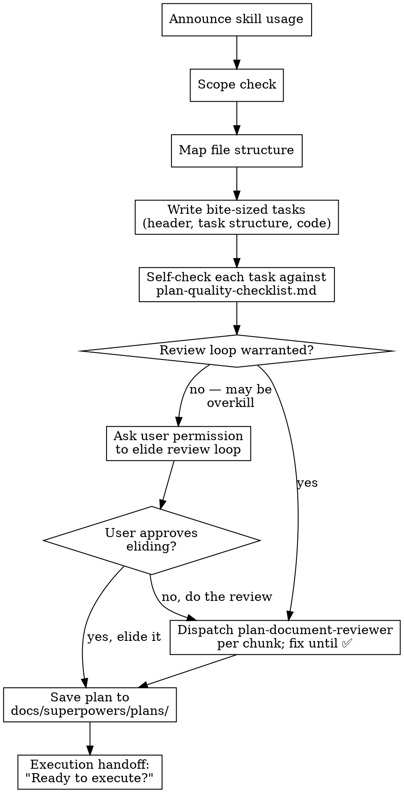

# Frontload Quality Thinking Into Plan Writing

> **For agentic workers:** REQUIRED: Use superpowers:subagent-driven-development (if subagents available) or superpowers:executing-plans to implement this plan. Steps use checkbox (`- [ ]`) syntax for tracking.

**Goal:** Reduce downstream rework by having the plan writer frontload quality concerns (error handling, edge cases, verification criteria) that reviewers currently catch reactively.

**Architecture:** Create a shared plan-quality-checklist.md reference file used by both the plan writer and the plan-document-reviewer. Enhance the writing-plans task template with mandatory quality-thinking sections. Add a self-check step to the writing-plans process flow. Update the implementer prompt to leverage the new quality sections.

**Tech Stack:** Markdown skill documentation only — no code.

**Context7 Findings:** N/A — no external libraries or APIs involved.

**Baseline (RED phase):** Real-world observations serve as baseline:

- Plan document reviewer almost always finds completeness issues (TODOs, placeholders, missing steps)
- Code quality reviewer almost always finds quality issues (error handling, edge cases, boundary conditions)
- Both cause rework loops that waste tokens and time

---

## Chunk 1: Shared Reference and Template Enhancement

### Task 1: Create plan-quality-checklist.md

**Files:**

- Create: `skills/writing-plans/plan-quality-checklist.md`

**Error handling:** N/A — documentation file, no executable code.

**Edge cases:** N/A — documentation file.

**Verification criteria:**

- File exists at correct path
- All four sections present: Task Completeness, Quality Thinking, Test Design, Spec Alignment
- Checklist items are actionable (start with verbs or have clear pass/fail criteria)
- No overlap or contradiction between sections

- [ ] **Step 1: Create the checklist file**

Create `skills/writing-plans/plan-quality-checklist.md` with this content:

```markdown
# Plan Quality Checklist

Use this checklist when writing plan tasks and when reviewing them. Both the plan writer and the plan-document-reviewer reference this file to ensure alignment.

## Task Completeness

- [ ] No TODO markers or placeholder text
- [ ] No "similar to X" without actual content — show the real code/steps
- [ ] Every step has exact commands with expected output
- [ ] Every code snippet is complete and copy-pasteable (not "add validation" — show the code)
- [ ] File paths are exact (relative to project root)
- [ ] Checkbox syntax (`- [ ]`) on all steps
- [ ] Each task has a clear, single-sentence purpose in its heading
- [ ] Dependencies between tasks are explicit (which tasks must complete first)

## Quality Thinking (per task)

- [ ] **Error handling** section identifies all fallible operations (I/O, network, parsing, user input)
- [ ] Error handling specifies _how_ each error should be handled (retry, fallback, propagate, user message)
- [ ] **Edge cases** section covers boundary conditions (empty inputs, null/missing values, max/min values)
- [ ] Edge cases section covers concurrency concerns where applicable
- [ ] **Verification criteria** go beyond "tests pass" — specify observable outcomes
- [ ] Code in steps reflects the error handling and edge cases listed above
- [ ] N/A sections include justification (not reflexive "N/A")

## Test Design (per task)

- [ ] Tests verify behavior, not implementation details
- [ ] Failure modes have explicit test cases (not just happy path)
- [ ] Edge cases from the edge-cases section have corresponding tests
- [ ] Expected test output includes specific assertion messages or error descriptions
- [ ] Verification commands are copy-pasteable with expected output documented
- [ ] Test names describe the behavior being verified

## Spec Alignment

- [ ] Task covers relevant spec requirements — nothing missing
- [ ] No scope creep (features or code not in the spec)
- [ ] No over-engineering or "nice-to-have" additions
- [ ] Interface boundaries match what the spec/design defined
```

- [ ] **Step 2: Verify the file**

Run: `cat skills/writing-plans/plan-quality-checklist.md | head -5`
Expected: Shows the `# Plan Quality Checklist` heading and first lines.

- [ ] **Step 3: Commit**

```bash
git add skills/writing-plans/plan-quality-checklist.md
git commit -m "feat: add shared plan-quality-checklist reference for plan writers and reviewers"
```

---

### Task 2: Enhance task template in writing-plans SKILL.md

**Files:**

- Modify: `skills/writing-plans/SKILL.md` — Task Structure section

**Error handling:** N/A — documentation edit.

**Edge cases:**

- The template must show N/A usage with justification so plan writers know the format
- The new sections must sit between `Files:` and the first step so they inform the code below

**Verification criteria:**

- Task Structure section in SKILL.md shows Error handling, Edge cases, Verification criteria between Files and Step 1
- Each new section includes inline guidance (bracketed instructions)
- N/A format demonstrated with justification requirement

- [ ] **Step 1: Update the Task Structure section**

In `skills/writing-plans/SKILL.md`, find the Task Structure section and replace the task template. The new template adds three quality-thinking sections between `**Files:**` and `**Step 1:**`:

Replace the existing task template block (from ` ```markdown` after `## Task Structure` through the closing ` ``` `) with:

````markdown
### Task N: [Component Name]

**Files:**

- Create: `exact/path/to/file.py`
- Modify: `exact/path/to/existing.py:123-145`
- Test: `tests/exact/path/to/test.py`

**Error handling:**

- [What operations can fail (I/O, network, parsing, user input) and how each should be handled]
- [Or: N/A — pure computation with no fallible operations (explain why)]

**Edge cases:**

- [Boundary conditions: empty inputs, null/missing values, max/min, concurrent access]
- [Or: N/A — no meaningful edge cases (explain why)]

**Verification criteria:**

- [How to confirm correctness beyond "tests pass" — observable outcomes for success and failure paths]
- [Or: N/A — tests fully capture correctness (explain why)]

- [ ] **Step 1: Write the failing test**

```python
def test_specific_behavior():
    result = function(input)
    assert result == expected
```

- [ ] **Step 2: Run test to verify it fails**

Run: `pytest tests/path/test.py::test_name -v`
Expected: FAIL with "function not defined"

- [ ] **Step 3: Write minimal implementation**

```python
def function(input):
    return expected
```

- [ ] **Step 4: Run test to verify it passes**

Run: `pytest tests/path/test.py::test_name -v`
Expected: PASS

- [ ] **Step 5: Commit**

```bash
git add tests/path/test.py src/path/file.py
git commit -m "feat: add specific feature"
```
````

- [ ] **Step 2: Update the Remember section**

In the same file, add a bullet to the "## Remember" section:

```markdown
- Error handling, Edge cases, and Verification criteria sections per task (N/A requires justification)
```

Add it after the "Complete code in plan" bullet.

- [ ] **Step 3: Verify the changes**

Run: `grep -A 3 "Error handling:" skills/writing-plans/SKILL.md`
Expected: Shows the new Error handling section in the task template.

Run: `grep "Error handling, Edge cases" skills/writing-plans/SKILL.md`
Expected: Shows the new Remember bullet.

- [ ] **Step 4: Commit**

```bash
git add skills/writing-plans/SKILL.md
git commit -m "feat: add quality-thinking sections to plan task template (error handling, edge cases, verification)"
```

---

### Task 3: Add self-check step to writing-plans process flow

**Files:**

- Modify: `skills/writing-plans/SKILL.md` — Process Flow section (graphviz diagram and surrounding text)

**Error handling:** N/A — documentation edit.

**Edge cases:**

- The graphviz diagram must remain syntactically valid after editing
- The self-check node must sit between "write_tasks" and "review_needed" in the flow

**Verification criteria:**

- Process Flow diagram includes a "self_check" node between write_tasks and review_needed
- A new prose paragraph explains the self-check step and references `plan-quality-checklist.md`

- [ ] **Step 1: Update the process flow diagram**

In `skills/writing-plans/SKILL.md`, find the `digraph writing_plans` block. Add a `self_check` node and update edges so the flow goes: `write_tasks → self_check → review_needed`.

The updated diagram should be:



- [ ] **Step 2: Add self-check prose**

After the process flow diagram and before the "## Plan Review Loop" section, add:

```markdown
## Self-Check Before Review

After writing all tasks, self-check each task against `plan-quality-checklist.md`:

1. Read `plan-quality-checklist.md` in this skill's directory
2. For each task, verify all applicable checklist items pass
3. Fix any gaps before proceeding to the review loop (or asking to elide it)

This catches the same issues the plan-document-reviewer would catch, reducing review loop iterations.
```

- [ ] **Step 3: Verify**

Run: `grep "self_check" skills/writing-plans/SKILL.md`
Expected: Shows the self_check node in the diagram.

Run: `grep "Self-Check Before Review" skills/writing-plans/SKILL.md`
Expected: Shows the new section heading.

- [ ] **Step 4: Commit**

```bash
git add skills/writing-plans/SKILL.md
git commit -m "feat: add self-check step to writing-plans process flow"
```

---

## Chunk 2: Reviewer and Implementer Alignment

### Task 4: Update plan-document-reviewer to reference checklist

**Files:**

- Modify: `skills/writing-plans/plan-document-reviewer-prompt.md`

**Error handling:** N/A — documentation edit.

**Edge cases:**

- The reviewer prompt must still be a valid subagent dispatch template
- The reviewer must be told to _read_ the checklist file, not just know about it

**Verification criteria:**

- Prompt template references `plan-quality-checklist.md` explicitly
- Prompt instructs subagent to read the file before reviewing
- The inline "What to Check" table is replaced with a reference to the checklist
- Template still contains all required dispatch structure

- [ ] **Step 1: Update the reviewer prompt**

In `skills/writing-plans/plan-document-reviewer-prompt.md`, replace the inline "What to Check" table and the CRITICAL section with a reference to the checklist file. The updated prompt template should be:

````markdown
# Plan Document Reviewer Prompt Template

Use the `Task tool (general-purpose)` block structure for the tool call, but only send the content under `prompt: |` as the subagent's actual prompt.

**Purpose:** Verify the plan chunk is complete, matches the spec, and has proper task decomposition.

**Dispatch after:** Each plan chunk is written

```
Task tool (general-purpose):
  description: "Review plan chunk N"
  prompt: |
    You are a plan document reviewer. Verify this plan chunk is complete and ready for implementation.

    **Plan chunk to review:** [PLAN_FILE_PATH] - Chunk N only
    **Spec for reference:** [SPEC_FILE_PATH]

    ## Before You Begin

    Read the plan quality checklist at `skills/writing-plans/plan-quality-checklist.md` (relative to the superpowers root). Use it as your primary review guide.

    ## What to Check

    Walk through every section of plan-quality-checklist.md for each task in this chunk:

    - **Task Completeness** — no TODOs, placeholders, "similar to X"; exact commands with expected output; complete code snippets; correct file paths
    - **Quality Thinking** — Error handling, Edge cases, and Verification criteria sections are present and substantive (N/A has justification); code in steps reflects the quality sections
    - **Test Design** — tests verify behavior not implementation; failure modes have test cases; edge cases have tests; verification commands are copy-pasteable
    - **Spec Alignment** — task covers spec requirements, no scope creep, no over-engineering

    Also check:
    - Task decomposition: tasks atomic, clear boundaries, steps actionable
    - File structure: files have clear single responsibilities
    - File size: would any new or modified file likely grow unwieldy?
    - Task syntax: checkbox syntax (`- [ ]`) on steps
    - Chunk size: each chunk under 1000 lines

    ## CRITICAL

    Look especially hard for:
    - Any TODO markers or placeholder text
    - Steps that say "similar to X" without actual content
    - Error handling / Edge cases / Verification criteria sections that say N/A without justification
    - Code in steps that ignores the error handling or edge cases listed in the task
    - Tests that only cover the happy path when edge cases are listed
    - Missing verification steps or expected outputs

    ## Output Format

    ## Plan Review - Chunk N

    **Status:** Approved | Issues Found

    **Issues (if any):**
    - [Task X, Step Y]: [specific issue] - [why it matters]

    **Recommendations (advisory):**
    - [suggestions that don't block approval]
```

**Reviewer returns:** Status, Issues (if any), Recommendations
````

- [ ] **Step 2: Verify**

Run: `grep "plan-quality-checklist.md" skills/writing-plans/plan-document-reviewer-prompt.md`
Expected: Shows references to the checklist file.

Run: `grep "Quality Thinking" skills/writing-plans/plan-document-reviewer-prompt.md`
Expected: Shows the new Quality Thinking bullet in What to Check.

- [ ] **Step 3: Commit**

```bash
git add skills/writing-plans/plan-document-reviewer-prompt.md
git commit -m "feat: align plan-document-reviewer with plan-quality-checklist reference"
```

---

### Task 5: Add quality-awareness note to implementer prompt

**Files:**

- Modify: `skills/subagent-driven-development/implementer-prompt.md`

**Error handling:** N/A — documentation edit.

**Edge cases:**

- Not all plan tasks will have quality sections (legacy plans written before this change)
- The implementer should gracefully handle missing sections

**Verification criteria:**

- Implementer prompt contains guidance to use Error Handling, Edge Cases, Verification Criteria from the task
- Guidance handles the case where those sections are absent (legacy plans)
- The note sits in the `## Your Job` section where it naturally fits

- [ ] **Step 1: Add quality-awareness guidance**

In `skills/subagent-driven-development/implementer-prompt.md`, find the `## Your Job` section inside the template. After the numbered list item `1. Implement exactly what the task specifies`, add:

```markdown
    - If the task includes **Error handling**, **Edge cases**, and **Verification criteria** sections, ensure your implementation addresses all items listed. If any item is impractical or incorrect, report as DONE_WITH_CONCERNS rather than silently ignoring it.
```

- [ ] **Step 2: Verify**

Run: `grep "Error handling.*Edge cases.*Verification criteria" skills/subagent-driven-development/implementer-prompt.md`
Expected: Shows the new quality-awareness guidance.

- [ ] **Step 3: Commit**

```bash
git add skills/subagent-driven-development/implementer-prompt.md
git commit -m "feat: add quality-awareness note to implementer prompt for plan quality sections"
```

---

## Verification (GREEN phase)

### Task 6: End-to-end verification

**Files:**

- Read: all modified files

**Error handling:** N/A — verification only.

**Edge cases:** N/A.

**Verification criteria:**

- All five files are consistent (checklist items align across plan writer, reviewer, and implementer)
- No broken cross-references
- Graphviz diagram is syntactically valid
- All committed

- [ ] **Step 1: Verify cross-references**

Run: `grep -r "plan-quality-checklist" skills/`
Expected: References in `writing-plans/SKILL.md` (self-check section) and `writing-plans/plan-document-reviewer-prompt.md`.

- [ ] **Step 2: Verify diagram syntax**

Run: `grep -c "self_check" skills/writing-plans/SKILL.md`
Expected: At least 2 (node definition + edge).

- [ ] **Step 3: Verify all changes committed**

Run: `git status`
Expected: Clean working tree (nothing to commit).

- [ ] **Step 4: Review git log**

Run: `git log --oneline -5`
Expected: Shows the 5 commits from tasks 1-5.
