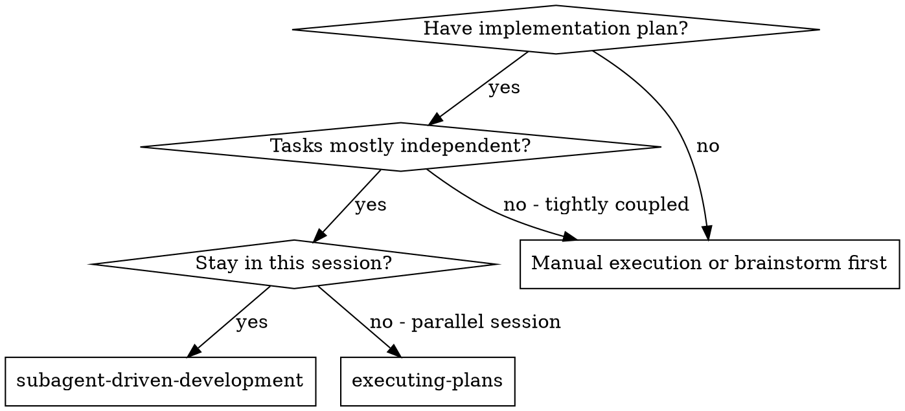
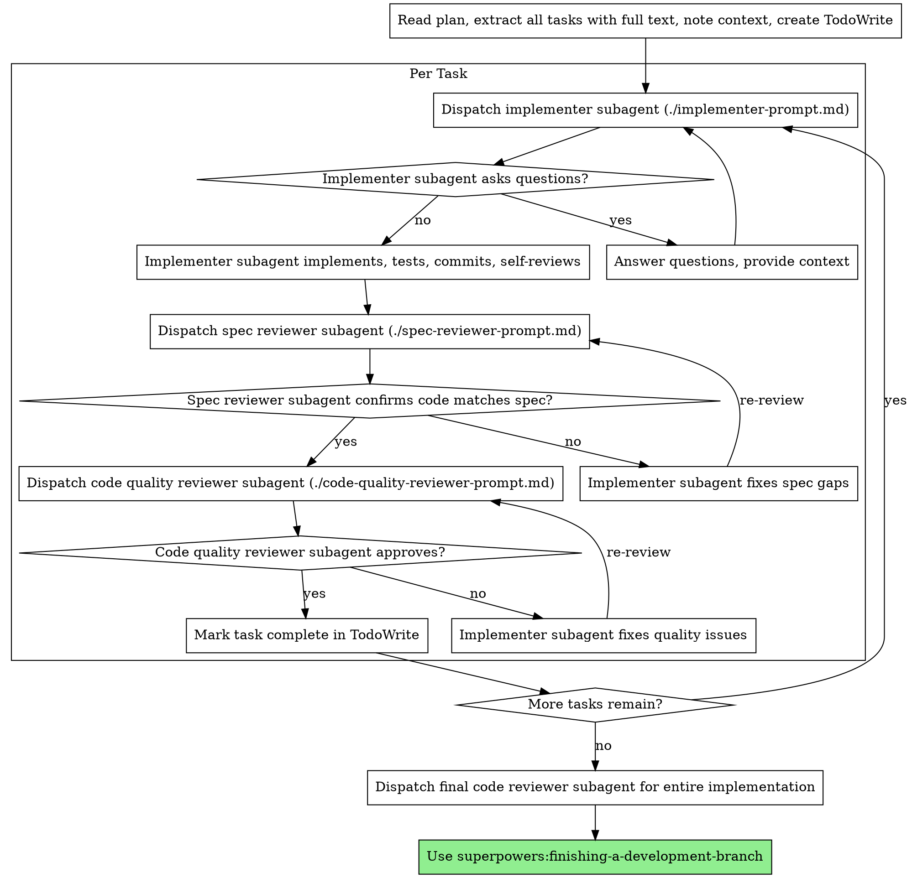

# Subagent-Driven Development

Execute plan by dispatching fresh subagent per task, with two-stage review after each: spec compliance review first, then code quality review.

**Why subagents:** You delegate tasks to specialized agents with isolated context. By precisely crafting their instructions and context, you ensure they stay focused and succeed at their task. They should never inherit your session's context or history — you construct exactly what they need. This also preserves your own context for coordination work.

**Core principle:** Fresh subagent per task + strictly sequential dispatch (no background tasks) + two-stage review (spec then quality) = high quality, fast iteration

<HARD-GATE>
DO NOT mark any task complete without dispatching BOTH reviewer subagents.
This is non-negotiable. No exceptions. No "going faster."

For EVERY task, you MUST dispatch:

1. Spec compliance reviewer subagent (./spec-reviewer-prompt.md)
2. Code quality reviewer subagent (./code-quality-reviewer-prompt.md)

If you skip either review, you are violating this skill. Period.
Skipping reviews is the #1 failure mode of this workflow. Do not rationalize it.
</HARD-GATE>

## When to Use



**vs. Executing Plans (parallel session):**

- Same session (no context switch)
- Fresh subagent per task (no context pollution)
- Two-stage review after each task: spec compliance first, then code quality
- Faster iteration (no human-in-loop between tasks)

## The Process



## Model Selection

Use the least powerful model that can handle each role to conserve cost and increase speed.

**Mechanical implementation tasks** (isolated functions, clear specs, 1-2 files): use a fast, cheap model. Most implementation tasks are mechanical when the plan is well-specified.

**Integration and judgment tasks** (multi-file coordination, pattern matching, debugging): use a standard model.

**Architecture, design, and review tasks**: use the most capable available model.

**Task complexity signals:**

- Single-file task with clear acceptance criteria AND a strong codebase pattern to follow → cheap model
- Multi-file task requiring codebase reading and pattern matching → standard model
- Cross-cutting tasks, architectural judgment, or ambiguous acceptance criteria → most capable model

**Codex multi-agent role mapping:**

- Implementer: `sp_implementer_spark`, `sp_implementer_standard`, or `sp_implementer_deep`
- Spec compliance reviewer: `sp_spec_reviewer`
- Code quality reviewer: `sp_code_reviewer`
- Final reviewer: `sp_code_reviewer`

**When to use `sp_implementer_spark`:**

- The task has clear acceptance criteria and a strong codebase pattern to follow
- The edit is small and local (single file)
- Existing patterns are clear and there is little architectural judgment required
- Re-dispatching to `sp_implementer_standard` would be cheap if the spark worker gets stuck

Do not use `sp_implementer_spark` as the default implementer. Treat it as an optimization for rote, well-specified plan steps. Use `sp_implementer_standard` for normal implementation work and `sp_implementer_deep` when reasoning depth is the real bottleneck.

## Dispatch Template Integrity

**GATE — Do not abbreviate prompt templates without user permission.**

When dispatching implementer/spec/code-quality reviewer subagents:

- Start from the template file on disk every time
- Paste the full template prompt (do not rewrite from memory)
- Replace placeholders only; keep all section headers
- If a section is not applicable, write `N/A` with a short reason
- If you believe a shorter prompt is sufficient, ask the user first

**Template-completeness check before dispatch:**

- Prompt uses the task-tool wrapper from the template (`Task tool ... description ... prompt: |`) for the tool call, but the subagent's prompt content should ONLY include the text under `prompt: |`.
- Implementer prompt contains `## Task Description`, `## Context`, `## Context7 Findings`, `## Before You Write Any Code`, `## Writing Tests`, `## Writing Implementation`, `## When the Plan and Codebase Disagree`, `## Code Organization`, `## Before Reporting Back: Self-Review`, and `## Report Format`
- Spec prompt contains `## What Was Requested`, `## What Implementer Claims They Built`, `## CRITICAL: Do Not Trust the Report`, and `## Your Job`
- Code-quality prompt is built from full `skills/requesting-code-review/code-reviewer.md` content with placeholders filled, plus subagent-driven additional checklist

If any required heading is missing, the dispatch is invalid. Rebuild from template before sending.

**Pre-dispatch codebase pointer check:** Before dispatching an implementer, verify that files listed in the task's **Codebase pointers** still exist (a previous task may have renamed or restructured them). Update stale pointers before dispatch.

## Prompt Templates

- `./implementer-prompt.md` - Dispatch implementer subagent
- `./spec-reviewer-prompt.md` - Dispatch spec compliance reviewer subagent
- `./code-quality-reviewer-prompt.md` - Dispatch code quality reviewer subagent

## Context7 Handoff Contract

With `superpowers:writing-plans`, Context7 findings should already be in the implementation plan header. The orchestrator should treat plan findings as the source of truth and pass them through to implementers.

Only do new external-library/API research if plan findings are missing, conflicting, or stale.

**GATE — Every implementer dispatch must include a `## Context7 Findings` section.**

Use one of these two forms:

1. Findings provided:
   - Copy relevant findings from the plan (and only add new research if fallback conditions apply)
   - Include concrete, task-relevant findings as bullets
   - Include constraints (what to avoid, deprecated APIs, version caveats)
   - Include requery policy: `DO_NOT_REQUERY_CONTEXT7`
2. Findings not needed:
   - Write `NONE — no external API/library uncertainty for this task`

**Implementer requery rule:**

- Implementer should not run Context7 again when findings are provided
- If findings appear missing, conflicting, or stale, implementer reports `NEEDS_CONTEXT` and waits for orchestrator guidance

**Orchestrator research rule:**

- Do not run Context7 by default during execution
- Run Context7 only when the plan does not contain usable findings for the task, or findings are conflicting/stale

## Decision Log

The orchestrator maintains a lightweight decision log across tasks in working memory (not a file). It captures deviations accepted and boundary decisions resolved at runtime.

**What goes in:**

- Accepted DONE_WITH_CONCERNS deviations with reasoning
- Complementing extras noted by spec reviewer
- Codebase-wins-over-plan decisions
- Plan ambiguities resolved at runtime

**What stays out:**

- Routine implementation details
- Review findings that were fixed normally

**How it's used:**

- Passed to each subsequent implementer in the `## Context` section as "Decisions from prior tasks"
- Passed to both reviewers in an "Accepted decisions for this task" section
- Reviewers treat accepted decisions as settled — they don't re-litigate them

**Filtering heuristic:** Include only entries that share an interface surface or boundary concern with the current task. Do not dump the full log into every dispatch.

## Handling Implementer Status

Implementer subagents report one of four statuses. Handle each appropriately:

**DONE:** Proceed to spec compliance review.

**DONE_WITH_CONCERNS:** The implementer completed the work but flagged concerns with categories. Handle each concern by category:

| Category          | Orchestrator Action                                                                                                    |
| ----------------- | ---------------------------------------------------------------------------------------------------------------------- |
| `SAFETY_ADDITION` | Accept if it doesn't contradict acceptance criteria or error handling section. Add to decision log. Proceed to review. |
| `PLAN_DEVIATION`  | If codebase-wins-HOW, accept and log. If it changes WHAT (contracts/interfaces), ask the human.                        |
| `SCOPE_QUESTION`  | Answer the question. Re-dispatch if the answer changes the implementation.                                             |
| `OBSERVATION`     | Note it. Proceed to review.                                                                                            |

After resolving concerns, include accepted items in the "Accepted decisions for this task" section when dispatching reviewers. This prevents the spec reviewer from flagging accepted safety additions as "extra work" and the code quality reviewer from re-litigating accepted plan deviations.

**NEEDS_CONTEXT:** The implementer needs information that wasn't provided. Provide the missing context and re-dispatch.

**BLOCKED:** The implementer cannot complete the task. Assess the blocker:

1. If it's a context problem, provide more context and re-dispatch with the same model
2. If the task requires more reasoning, re-dispatch with a more capable model
3. If the task is too large, break it into smaller pieces
4. If the plan itself is wrong, escalate to the human

**Never** ignore an escalation or force the same model to retry without changes. If the implementer said it's stuck, something needs to change.

## Scoped Re-Reviews

When a reviewer finds issues and the implementer fixes them, the re-review dispatch must be scoped to the delta:

1. Include the original review findings
2. Include what the implementer changed to address them
3. Add this instruction: "Verify the fixes address the original findings. Do not raise new issues on code already reviewed and approved in the previous pass, unless the fix introduced a regression."

This prevents cascading review loops where a fix triggers new findings on previously-approved code.

## Example Workflow

```
You: I'm using Subagent-Driven Development to execute this plan.

[Read plan file once: docs/superpowers/plans/feature-plan.md]
[Extract all 5 tasks with full text and context]
[Create TodoWrite with all tasks]

Task 1: Hook installation script

[Get Task 1 text and context (already extracted)]
[Dispatch implementation subagent with full task text + context]

Implementer: "Before I begin - should the hook be installed at user or system level?"

You: "User level (~/.config/superpowers/hooks/)"

Implementer: "Got it. Implementing now..."
[Later] Implementer:
  - Implemented install-hook command
  - Added tests, 5/5 passing
  - Self-review: Found I missed --force flag, added it
  - Committed

[Dispatch spec compliance reviewer]
Spec reviewer: ✅ Spec compliant - all requirements met, nothing extra

[Get git SHAs, dispatch code quality reviewer]
Code reviewer: Strengths: Good test coverage, clean. Issues: None. Approved.

[Mark Task 1 complete]

Task 2: Recovery modes

[Get Task 2 text and context (already extracted)]
[Dispatch implementation subagent with full task text + context]

Implementer: [No questions, proceeds]
Implementer:
  - Added verify/repair modes
  - 8/8 tests passing
  - Self-review: All good
  - Committed

[Dispatch spec compliance reviewer]
Spec reviewer: ❌ Issues:
  - Missing: Progress reporting (spec says "report every 100 items")
  - Extra: Added --json flag (not requested)

[Implementer fixes issues]
Implementer: Removed --json flag, added progress reporting

[Spec reviewer reviews again]
Spec reviewer: ✅ Spec compliant now

[Dispatch code quality reviewer]
Code reviewer: Strengths: Solid. Issues (Important): Magic number (100)

[Implementer fixes]
Implementer: Extracted PROGRESS_INTERVAL constant

[Code reviewer reviews again]
Code reviewer: ✅ Approved

[Mark Task 2 complete]

...

[After all tasks]
[Dispatch final code-reviewer]
Final reviewer: All requirements met, ready to merge

Done!
```

## Advantages

**vs. Manual execution:**

- Subagents follow TDD naturally
- Fresh context per task (no confusion)
- Parallel-safe (subagents don't interfere)
- Subagent can ask questions (before AND during work)

**vs. Executing Plans:**

- Same session (no handoff)
- Continuous progress (no waiting)
- Review checkpoints automatic

**Efficiency gains:**

- No file reading overhead (controller provides full text)
- Controller curates exactly what context is needed
- Subagent gets complete information upfront
- Questions surfaced before work begins (not after)

**Quality gates:**

- Self-review catches issues before handoff
- Two-stage review: spec compliance, then code quality
- Review loops ensure fixes actually work
- Spec compliance prevents over/under-building
- Code quality ensures implementation is well-built

**Cost:**

- More subagent invocations (implementer + 2 reviewers per task)
- Controller does more prep work (extracting all tasks upfront)
- Review loops add iterations
- But catches issues early (cheaper than debugging later)

## Red Flags

**Never:**

- Start implementation on main/master branch without explicit user consent
- **NEVER skip reviews (spec compliance OR code quality) — this is the #1 failure mode of this workflow**
- Proceed with unfixed issues
- Dispatch multiple implementation subagents in parallel (conflicts)
  - Keep implementation dispatch strictly synchronous (one task at a time)
  - Rationale: background retrieval can return truncated transcript fragments and break review gates
- Make subagent read plan file (provide full text instead)
- Dispatch prompts from memory instead of the template files
- Remove template sections because of time pressure/SLA pressure
- Send an implementer prompt missing any required heading (invalid dispatch)
- Make implementer subagent do documentation research you could have done once up front
- Let implementer subagent guess third-party APIs/config when Context7 research is required
- Provide "Context7 is done" without including the actual findings in `## Context7 Findings`
- Let implementer rerun Context7 when findings were already provided (unless they reported `NEEDS_CONTEXT`)
- Rerun Context7 during execution when the plan already contains usable findings
- Skip scene-setting context (subagent needs to understand where task fits)
- Ignore subagent questions (answer before letting them proceed)
- Accept "close enough" on spec compliance (spec reviewer found issues = not done)
- Skip review loops (reviewer found issues = implementer fixes = review again)
- Let implementer self-review replace actual review (both are needed)
- **Start code quality review before spec compliance is ✅** (wrong order)
- Move to next task while either review has open issues

**If subagent asks questions:**

- Answer clearly and completely
- Provide additional context if needed
- Don't rush them into implementation

**If reviewer finds issues:**

- Implementer (same subagent) fixes them
- Reviewer reviews again
- Repeat until approved
- Don't skip the re-review

**If subagent fails task:**

- Dispatch fix subagent with specific instructions
- Don't try to fix manually (context pollution)

## Common Rationalizations and Counters

| Rationalization                                             | Reality                                                                                                           |
| ----------------------------------------------------------- | ----------------------------------------------------------------------------------------------------------------- |
| "I'll send the essentials; full template is too long."      | Template omissions remove safeguards. Use full template or ask user to elide.                                     |
| "We're under SLA pressure; reviewers can use slim prompts." | Pressure is when omissions are most dangerous. Keep full templates.                                               |
| "This is simple; a partial implementer prompt is enough."   | Simple tasks still need full handoff contract. Missing headings = invalid dispatch.                               |
| "I already did Context7, so I'll just say it's done."       | Implementer needs concrete findings, not a status label. Paste findings in `## Context7 Findings`.                |
| "Implementer can re-query Context7 if needed."              | Duplicate research wastes time and can introduce conflicting guidance. Orchestrator owns the research handoff.    |
| "I'll re-run Context7 to be safe."                          | If plan findings are present and usable, re-running is waste. Re-run only for missing/conflicting/stale findings. |

## Integration

**Required workflow skills:**

- **superpowers:using-feature-branches-with-submodules** - REQUIRED: Set up branch-based isolation (submodules-friendly) before starting
- **superpowers:writing-plans** - Creates the plan this skill executes
- **superpowers:requesting-code-review** - Code review template for reviewer subagents
- **superpowers:finishing-a-development-branch** - Complete development after all tasks

**Subagents should use:**

- **superpowers:test-driven-development** - Subagents follow TDD for each task

**Alternative workflow:**

- **superpowers:executing-plans** - Use for parallel session instead of same-session execution
